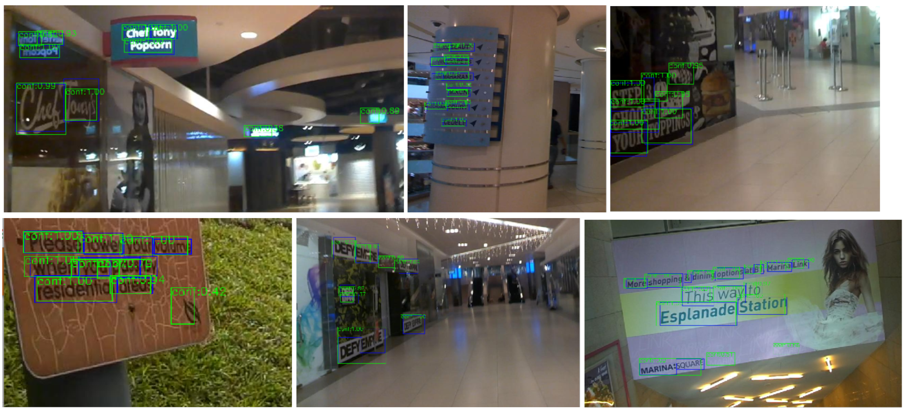
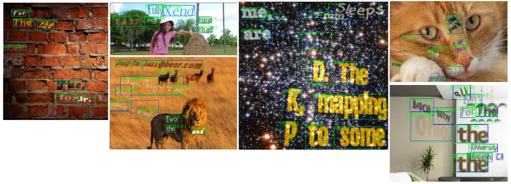

## RetinaNet-Text-Detection

**Work in progress (Fork of [wondervictor/RetinaNet](github.com/wondervictor/RetinaNet))**

RetinaNet for `Text Detection` implemented with Pure PyTorch

### Results

* ICDAR

* SynthText

### Licence

This project is under the **MIT Licence**